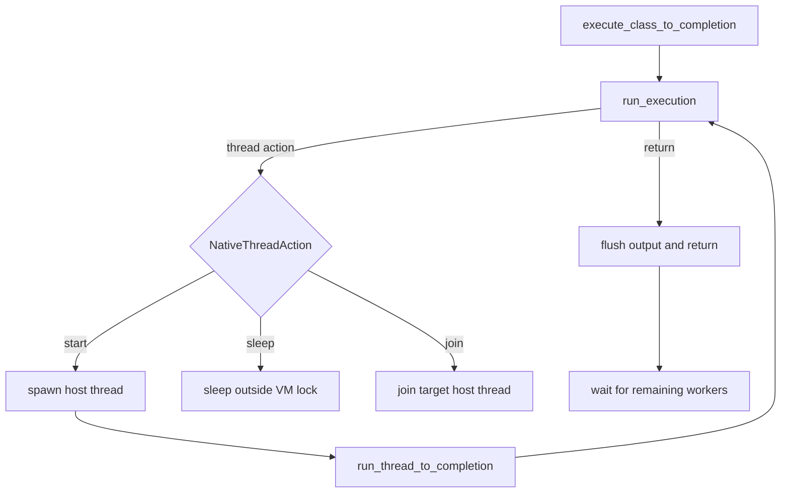

# ADR 001: Basic Threading Runtime

- Date: 2026-03-19
- Status: Accepted

## Context

Phase 28 needs enough `java.lang.Thread` and `java.lang.Runnable` support to run
basic background work: `start()`, `sleep()`, `join()`, subclassed `run()`, and
`Runnable` targets. Duke's interpreter was single-threaded, with bytecode
execution coupled to one large `execute_class()` loop.

Two constraints shape the implementation:

1. `monitorenter` and `monitorexit` were intentionally left as no-ops in Phase
   18, so real monitor ownership and lock scheduling do not exist yet.
2. GC root gathering only understands the currently executing frame stack and
   registered static fields. It is not safe to pretend paused worker threads are
   already visible to the collector.

## Decision

Phase 28 uses host OS threads plus a single shared interpreter critical section.

- Add synthetic bootstrap definitions for `java/lang/Runnable` and
  `java/lang/Thread`.
- Implement `Thread.<init>()`, `Thread.<init>(Runnable)`, `Thread.start()`,
  `Thread.join()`, and `Thread.sleep(long)` as native hooks.
- Native thread hooks do not block directly inside the native handler. They
  record a `NativeThreadAction`, and the interpreter handles that action after
  the current native call postlude completes.
- Extract interpreter-local execution state into a resumable `ExecutionState`
  and add `execute_class_to_completion()` as the top-level entrypoint for
  threaded programs.
- Map each started Java thread to one host thread, but allow only one thread at
  a time to mutate interpreter state, heap state, registry state, and captured
  output.
- Keep the VM alive until all started worker threads complete. Daemon thread
  behavior is still out of scope, so Phase 28 treats started threads as
  non-daemon for shutdown purposes.
- Keep `monitorenter` and `monitorexit` as no-ops in this phase.
- Suspend GC while worker threads are live by disabling allocation-triggered
  collection whenever the threaded runtime has active workers.

## Consequences

This lands basic thread lifecycle support without claiming full JVM
concurrency semantics.

- `Thread.start()`, `Thread.sleep()`, and `Thread.join()` work for the current
  acceptance fixtures.
- Worker threads do not sleep or join while holding the interpreter mutex.
- Bytecode execution is still effectively serialized behind one shared VM lock.
- Programs that rely on real monitor behavior, `wait`/`notify`, interruption,
  daemon threads, or `java.util.concurrent` remain unsupported.
- GC stays conservative: it is paused while workers are live instead of risking
  unsound root handling across paused thread state.

## Known Limits

- Callback-native reentry still routes nested Java execution through the legacy
  `execute_class()` path, so nested thread actions from callback reentry are not
  covered by this phase.
- Class initialization (`<clinit>`) still uses the legacy execution path, so
  thread actions originating inside class initializers are not part of the
  Phase 28 guarantee.

## Follow-up

- Add real monitor ownership and blocking semantics.
- Teach callback reentry and `<clinit>` to participate in the completion runner.
- Build a thread-aware GC root model instead of globally suppressing collection
  while workers are live.
- Add daemon threads, interruption, and `wait`/`notify`.

## Diagram

